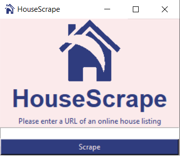
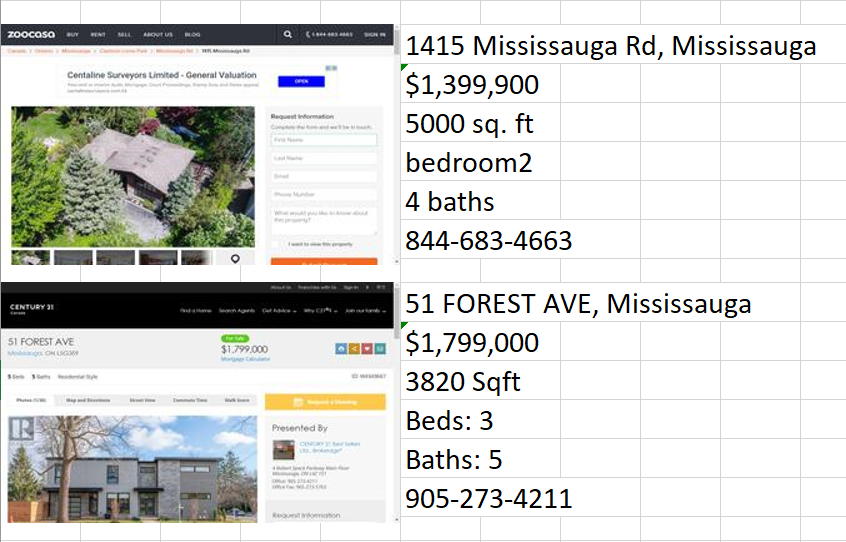

# Meet HouseScrape
The simple webscraper solution to getting the most important information from a house listing

Outputs all data to an Excel file for ease of access and customizability

## Installation
1. Clone the repository
2. Open the exe file
3. You're done!

## Quick Notes
Must have Chrome installed on machine (webdriver utilizes it to take screenshots of listings)
